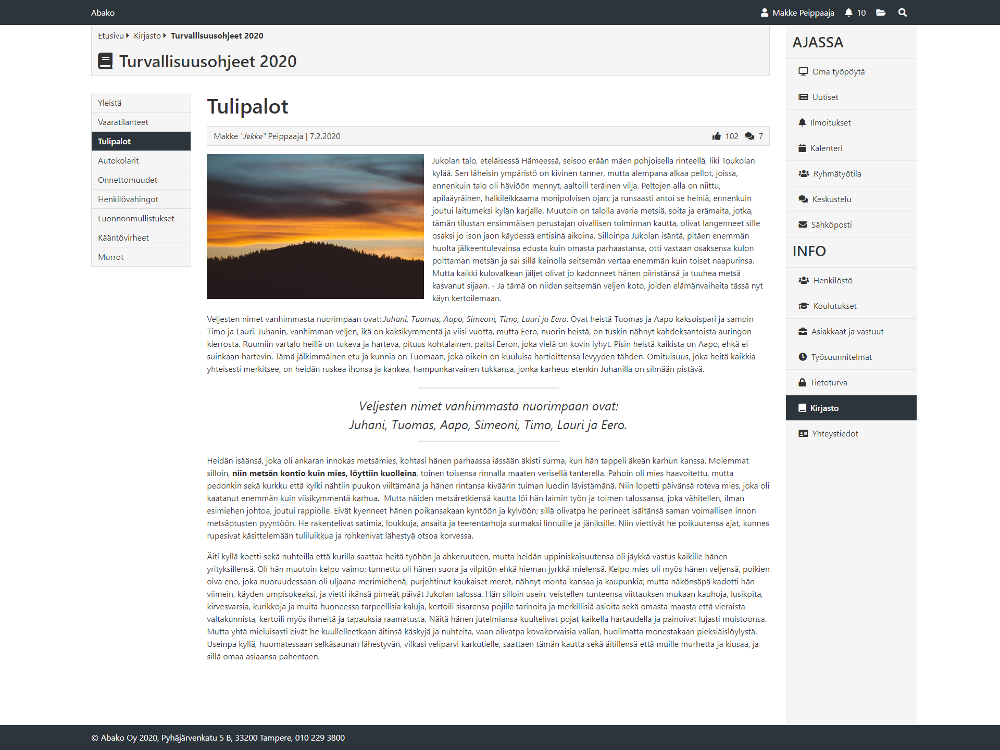

# Assignment (UX/UI/Frontend)

Tehtävänanto

1. Jalostaa oheisesta Intranet-mallisivusta HTML5-versio käyttäen erillistä CSS-tyylitiedostoa. Käytä layoutin taittoon Bootstrap -kirjastoa. Ensimmäisen osuuden tavoitteena on nähdä ohjelmoijan taidot CSS Frameworkin ja Flexboxin hyödyntämisessä, sekä selkeän HTML & CSS tuottamisessa.

2. Hyödyntää ikonikirjastoa. Kuvassa olevat ikonit ovat Font Awesome -ikonifonttikirjastosta. Voit käyttää työssä myös jotakin muuta ikonikirjastoa, eikä ikonien tarvitse olla juuri esimerkissä löytyviä. Esimerkissä on käytetty versiota 4, mutta voit käyttää uusintakin.

3. Käyttää ulkoista tietolähdettä JavaScriptillä. Vasemmassa palstassa näkyvä navigaatio muuttuu usein; tavoitteena on selvittää ohjelmoijan kyky hyödyntää ulkoista dataa webbisivulla, eli tässä tapauksessa sen avulla navigaation rakentamiseen. Luo kuvan mukainen navigaatio ulkoiseen tiedostoon, ja näytä se sivustolla valitsemallasi tavalla.

4. Käyttää vähintään yhtä Web Componenttia jonkin sivulla toistuvan HTML-rakenteen kapselointiin custom elementiksi.



Ratkaisu

Työ/käyttöympäristö: IDE: Visual Studio Code (+ Live Server http://127.0.0.1/) , Selain: Chrome

Työprosessin kuvaus:

1. En ole ennen tehnyt sivustoa alusta asti Bootstrap kehitysympäristöllä (olen ennen modifoinut jo valmiita Bootstrap-sivustoja)
joten ensin opiskelua mitä tarvitaan sivuston luomiseen. Tämän jälkeen tein simppelin flexbox sivun muutamalla columnilla joten
näen ja ymmärrän miten Bootstrap toiminnan.

2. Tämän jälkeen kokosin haluttua mallikuvaa mukaillen sivupohjan pelkistetyn gridin jotta sain kaikki sivuston elementit
oikeille paikoilleen. Tässä itselleni apuna laitoin tiettyihin pääelementteihin (```<div class="container">, <div class="row">```
sekä ```<div class="col-sm">```) väliaikaiset inline tyylit (border: 1px solid black) jolla hahmotin että missä minkäkin elementin
pitää olla ja onko elementin oikeilla paikoillaan. Seuraavana lisäsin sivupohjaan header ja footer elementit.

3. Seuraavana työvaiheena oli sivun vasemmassa ja oikeassa reunassa olevat navigaatioden lisääminen javacriptilla suoraan
sivupohjan oikeaan elementtiin (<script> ...code ...</script>). Navigaatioissa oleva data tehtiin JSON -muotoon ja tämä
muuttujassa oleva JSON data loopattiin sivulle .map() funktion avulla. Näin saatiin tulostettua sivulle oikeanlainen
navigaatioiden sisältö.

4. Sivun tekstisisältöjen lisäys eli otsikot, murupolku, artikkelin teksti sekä kuva, headerin ja footerin tekstit.

5. Tyylien lisääminen oli seuraava työvaihe. Oman tyylitiedoston luominen johon omia tyyliluokkia halutuilla väriarvoilla
eri elementeille, tekstien ja taustojen värit, borderit/paddingit, hoverit yms. jotta sain mahdollisimman lähelle haluttua
sivuston mallikuvaa.

6. Font Awesome ei ollut minulle ennalta tuttu joten siihen tutustuminen. Olen käyttänyt Reactin MUI kirjastoa joka on
periaatteellisesti samanlainen ikoni-kirjasto joten siinä mielessä tämä oli tuttua. Tyylitiedoston linkki sivun Headiin
ja etsimään samanlaisia ikonia joita oli esimerkkisivussa ja niiden lisääminen headerin oikeassa reunassa olevaan
osioon, Oikeat ikonit Turvallisuusohjeet 2020 -otsikon eteen sekä artikkelin kirjoittajan blokkiin.

7. Oikeiden ikonien lisääminen oikeassa reunassa olevaan navigaatioon oli seuraava työvaihe. Lisäsin JSON -dataan uuden
key/value -parin johon lisäsin halutun ikonin haluttuun navigation kohtaan (esim. fa: "fa-desktop") ja tulostin sen
.map() funktioon (```<i class="fa ${item.fa}"></i>```).

8. Web Componentit olivat minulle suht uusi asia eli en ollut niitä itse tehnyt. Tehtävänantona oli tehdä toistuvan
HTML-rakenteen custom elementti. Tutustumisen ja opiskelun kautta tein kaksi peruskomponenttiä jotka toistuvat
sivupohjassa eli headerissa oleva firman nimi Abako (```<abako-home></abako-home>```) sekä footerissä oleva Abakon
yhteystiedot (```<abako-connect-info></abako-connect-info>```).

9. Viimeisenä isompana tehtävä oli saada vasemmanreunan navigaation tiedot tulemaan ulkoisesta tietolähteestä eli
päätin että tämä ulkoinen tietolähde on erillinen json -tiedosto. Tässä oli monenlaista ongelmaan pitkin tätä projektia
kun yritin aina välillä palata tämän osion ratkaisuun. Ongelmat johtuivat pääasiassa siitä että kun avaa selaimella suoraan
index.html -tiedostoa niin javascript -tiedostojen tuomisen yhteydessä tulee monenlaista virheilmoituksia esimerkiksi
CORS politiikkaan liittyen, eli ei voi avata js-tiedostoja. Tässä ratkaisuna on että json/js tiedostot on ajettava joko
lokaalilla tai remote serverillä. Visual Studio Codessa on Live Server joka luo lokaalin serverin (http://127.0.0.1/)
jonka kautta nämä CORS -ongelmat poistuivat ja sain importattua vasemman navigaation datan suoraan erillisestä json -tiedostosta
(/json/leftNavigation.json) javascript tiedostoon (/js/navigation.js) jonka kautta navigaatio luodaan index.html -sivulle.

10. Lopuksi siivosin vielä kaikista tiedostoista käyttämättömät koodirivit millä ei ole enää käyttöä sekä poistin inline-tyylit html-tiedostosta ja siirsin ne haettavaksi tyylitiedostosta. 

